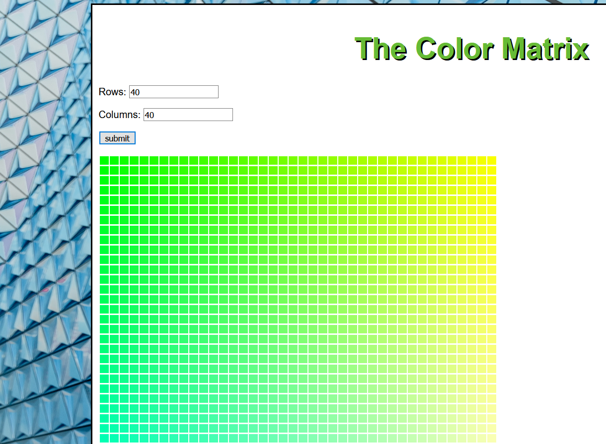

# ColorGrid

## JavaScript app builds a multi-color grid

App builds a multi-color grid of color boxes, based on the user's input of row numbers and column numbers.  App contains input validation on the row and column inputs, and uses loop logic for the program.

